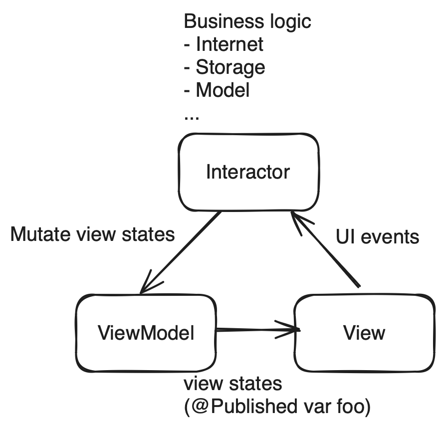

# MVVMI
Model-View-ViewModel-Interactor Architecture designed for SwiftUI. Scale your SwiftUI app into the next level.

## Why MVVMI?

If you or your team is experiencing scaling problems with all the code placed inside SwiftUI `View`, but do not want to drastically depart from MVVMx architecture, then MVVMI can be a great fit.

- Since MVVMI is a variant of the standard MVVM design pattern, it's easy to understand and use if developers have past experience with MVVM.

- No new concepts or APIs are invented by this framework. It leverages SwiftUI's `@StateObject` and `@Published` API.

- It also addresses some common pitfalls when using Swift Concurrency for async programming.

## What's wrong with a single view?

The single-view architecture used in Apple's tutorial may work fine when the app is small. However as the app's complexity grows, baking everything(UI, state management, events, business logic) into `View` will quickly become unscalable. Besides that code will be clustered and difficult to read, maintain or unit test, there are some additional drawbacks and pitfalls in SwiftUI and concurrency world:

### Threading
It's very easy to make threading mistake inside a single view. Just think about a very simple use case:
1.  The user clicks a button
2.  The app performs some computation
3.  The app mutates view state via `@State`

Here 1 and 3 are supposed to be executed on main actor, while 2 is not. By default SwiftUI `View` is main actor isolated which makes it non-trivial to make 2 happen on non main actors. Below are some incorrect examples:

```swift
// Wrong! Computation is still on main actor
struct MyView: View {
    var body: some View {
        Button("test", action: {
            Task {
                //perform computation
            }
        })
    }
}
```

```swift
// Wrong! Computation is still on main actor
struct MyView: View {

    func computation() async { 
        //perform computation
    }

    var body: some View {
        Button("test", action: {
            await computation()
        })
    }
}
```

```swift
// Correct. Computation is not on main actor
struct MyView: View {

    nonisolated func computation() async { 
        //perform computation
    }

    var body: some View {
        Button("test", action: {
            await computation()
        })
    }
}
```

Not to mention that we also need to remember to perform 3 back on main actor. Many developers could simply forget that.

There are two consequences of this problem:
1. Your app may not be very responsive. Telemetry tools like Sentry will report lots of app hangs.
2. You may get Xcode warnings that you are mutating view states from a background thread. Which according to Apple is "undefined behavior".

### EnvironmentObject

`@EnvironmentObject` is Apple's solution to dependency injection in SwiftUI world. It works well with the single view pattern Apple uses. However it has some drawbacks.

#### Run-time safety
`@EnvironmentObject` is not run-time safe. App will crash if the dependency is not supplied. Modern DI frameworks like [Hilt](https://developer.android.com/training/dependency-injection/hilt-android) and [needle](https://github.com/uber/needle) are compile-time safe.

#### No abstraction
`@EnvironmentObject` must conform to `ObservableObject`, which means it can also perform view state binding and hold business logic. It tends to conflate many things together which makes abstraction very difficult.

One problem with it is that because of the limitation of existential types, you cannnot expose a dependency as a protocol when using `@EnvironmentObject`. Let's say if you attempt to do this:

```swift
protocol GlobalStateProtocol: ObservableObject {
    func toggle()
}

final class GlobalState: GlobalStateProtocol {
        
    func toggle() {
        //This is to be exposed to MyView
    }

    func otherMethod() { 
        //This is not to be exposed to MyView
    }
}

struct WordleView: View {
  
    @EnvironmentObject var state: any GlobalStateProtocol //Compile error
}
```
Swift will complain:

> Type 'any GlobalStateProtocol' cannot conform to 'ObservableObject'

#### Unintended view bindings

Another problem is that once you start to add `@Published` properties into `@EnvironmentObject`, it will cause a redraw for every view that references the object, even if the `View` may not consume the value of that state.

Let's look at the below example. `MyView` does not care about the value of the field `irrelavant`, however it needs a reference to `GlobalState` in order to toggle it. Unfortunately `MyView` will also redraw if the value changes.

```swift
final class GlobalState: ObservableObject {
    
    @Published var irrelavant: Bool = false
    
    func toggle() {
        irrelavant.toggle()
    }
}

struct MyView: View {
  
  @EnvironmentObject var state: GlobalState
  
  var body: some View {
    let _ = Self._printChanges()
    Button("test", action: {
        state.toggle()
    })
  }
}
```

## Usage

### Examples
The quickest way to understand how to use it is to check out our sample apps in the repository. Below is a diagram demonstrating the responsibility of each component.



Fig 1. MVVMI

## Other Alternatives

If you are not a fan of MVVMx architecture or are familar with React/Redux pattern, feel free to check out [composable architecture](https://github.com/pointfreeco/swift-composable-architecture).


